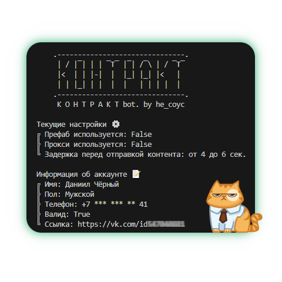

# KOHTPAKT bot.
## О проекте 📝
KOHTPAKT bot. - это программа для спама под постами в группах, а так же профилях пользователей в социальной сети ВКонтакте. В боте было реализовано много необходимых функций, включая использование прокси с протоколом socks5 и генерацию случайного юзерагента для маскировки цифрового следа пользователя. Полный список всех функций бота можно найти ниже.
<br>
Самой интересной особенностью бота, я считаю, является возможность использования префаба, то есть оформление пустой странички по заранее подготовленному шаблону.
<p align="center">

</p>

Бот написан на языке программирования `python` всего за ***300 строк чистой ярости***. Исходники распространяются по лицензии MIT, то есть ты можешь спокойно использовать и модифицировать программу, не боясь получить по попе.

## Что умеет бот? 🤖
Все функции программы на данный момент:
+ Работа с прокси 🌐
+ Использование случайного юзерагента при каждом запуске (только с прокси) 🎭
+ Подготовка странички из префаба, например бот может:
  + Ставить свою аватарку 👾
  + Ставить свой статус 📝
  + Создавать закреп с прикреплённой ссылкой 🔗
  + Подписываться на группы из списка 📃
+ Спам в комментах по группам из списка (само собой) 😈
+ Авторизация **только** с помощью токена 💋
+ Спам случайными сообщениями, по желанию можно:
  + Ставить самолайк ❤
  + Прикреплять картинку к комментарию 🖼
+ Детект капчи 🙄
+ Детект бана странички 🔒
+ Загрузка изображений в публичный альбом 📷

Бота можно настроить путём редактирования файла `config.py`

## Окей, как мне начать пользоваться ботом? 🤔
1. Для начала ты должен скачать питон.
Как это сделать описано
[здесь](https://python-scripts.com/install-python)

2. Установи все необходимые модули.
Для этого ты должен открыть командную строку и ввести следующие команды:
```
pip install vk-api
pip install pyOpenSSL
pip install pySocks
pip install requests
pip install fake_useragent
```
3. Скачай файлы `main.py` и `config.py` из этого репозитория.
4. Настрой файл конфигурации.
В этом нет ничего сложного, в файле много подсказок. Открыть `config.py` можно даже с помощью блокнота.
5. Запусти бота.
Если у тебя уже установлен Visual Studio Code, ты можешь просто открыть файл `main.py` и  нажать клавишу F5. После этого бот начнет свою работу в автоматическом режиме.
Если у тебя ещё нет VSC, ты должен кликнуть правой кнопкой мыши по файлу -> Edit with idle -> F5


## Мне нужно знать что-то ещё? 🤓
Нет, это всё.
